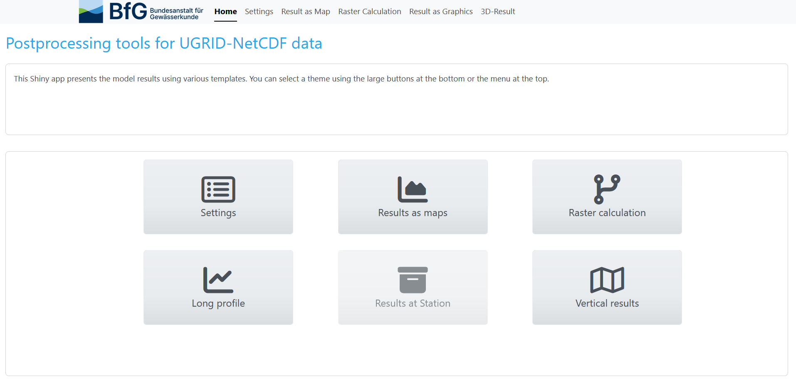
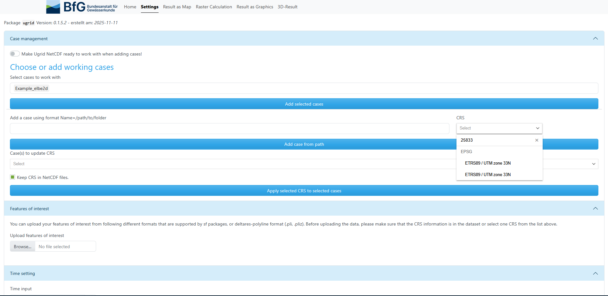
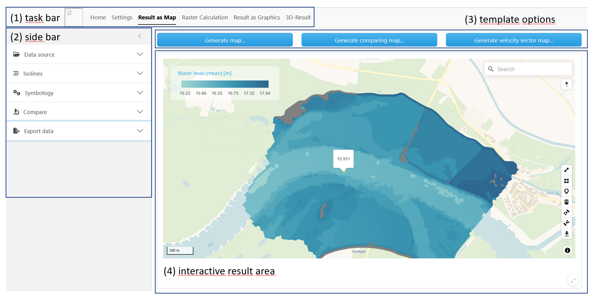
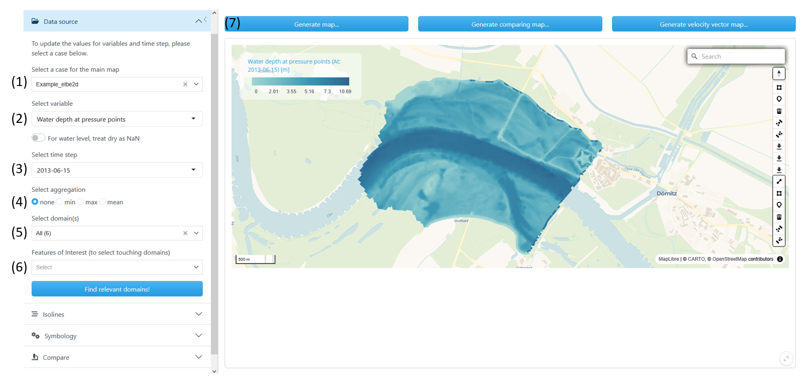
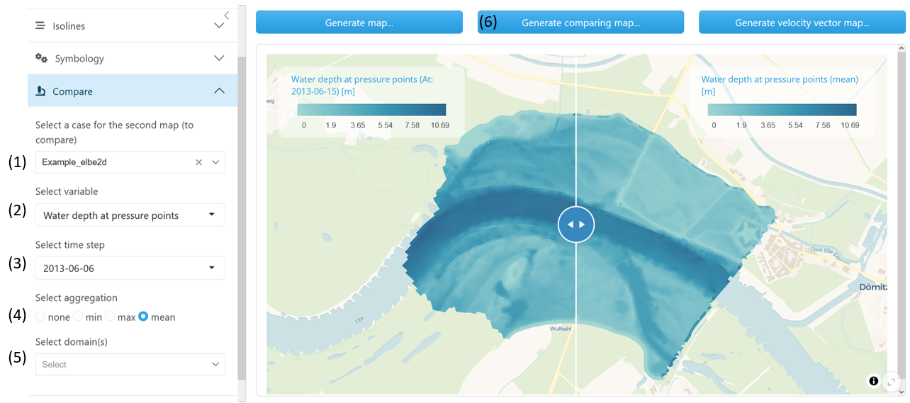
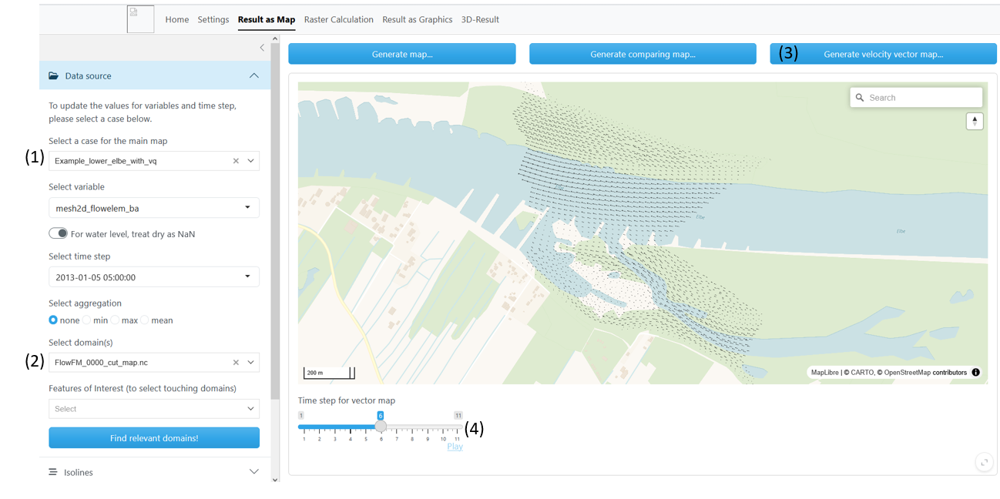
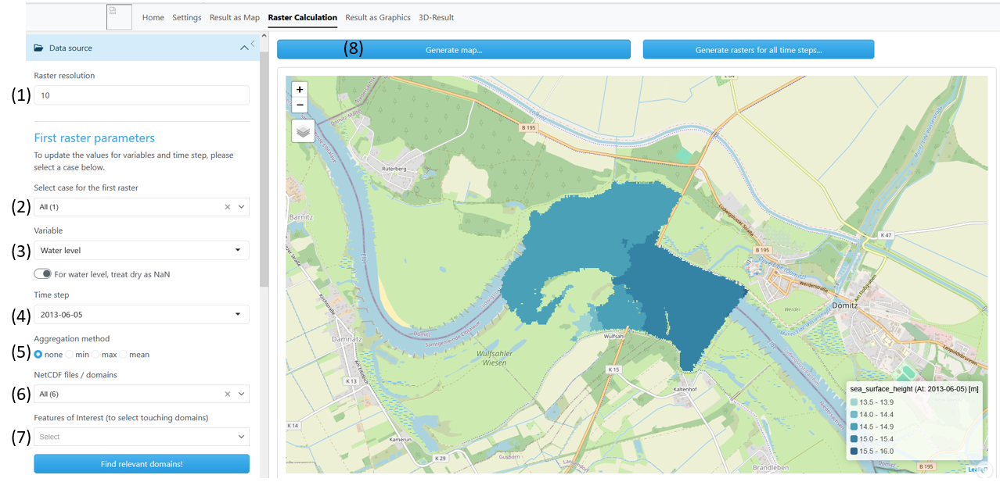
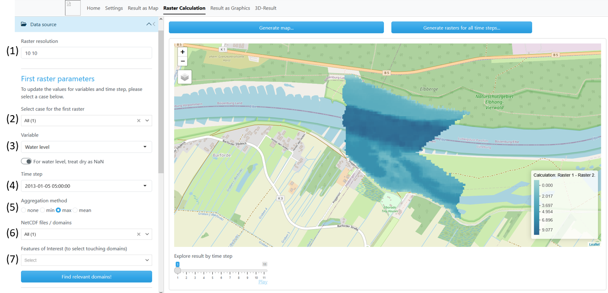
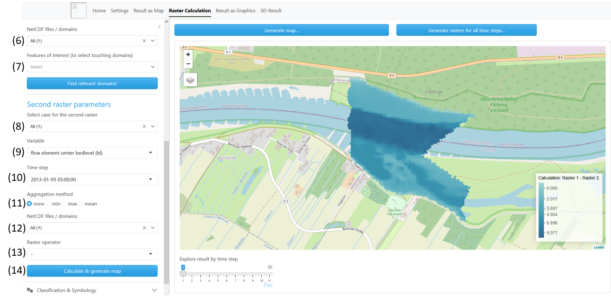

```{r, include = FALSE}
knitr::opts_chunk$set(
  collapse = TRUE,
  comment = "#>"
)
```

```{r setup}
library(ugrid)
```

```{=html}
<!--#  
# This adds a Link to Settings section: [`r shiny::icon(name="list-alt")` Settings]
# Open Questions:
# what does this switch on top of Settings page do? "Make Ugrid NetCDF ready to work with when adding cases!"
# what does the button "Keep CRS in NetCDF files." do?-->
```

## Introduction

The R-package Ugrid enables users to visually inspect and post-process model output stored in NetCDF files following UGIRD convention. While it is primarily designed to handle results from Delft3D-FM, it can be used with any UGRID-compliant NetCDF dataset. The data are encapsulated in an R6 object, where the 2D mesh is represented as a polygon layer, enabling seamless integration with additional post-processing functions included in the package. For users who prefer a graphical interface, the package also provides a Shiny application that brings together the most important functionalities. This allows convenient data exploration and processing without requiring prior knowledge of R programming. Processed data can also be directly downloaded from within the app. This vignette focuses on the processing of data using the Shiny application. The User Interfaces of the Shiny-App will be presented. The different possibilities of data processing and mapping will be shown. The requested user inputs will be explained.

## Terminology

**Case:** A case is a set of NetCDF files (or a single) containing mesh data in UGRID convetion. This can be results of a model run of Delft3D-FM.\
**Domain:** A domain is defined by the extend of one NetCDF file. A case can contain multiple domains.\
**Features of interest:** This is additional information, as polylines and polygons. Expected data formats are pli and pliz (Deltares-polyline format), as well as any format supported by R sf packages (e.g. shp).

## User Interface (UI)

### Home

The Ugrid UI has several tabs that can be accessed via buttons. The *Home* screen gives an overview to choose from. To get started on a project, the tab *Settings* is essential. Here the user chooses working cases with its affiliate data. Evaluation of the data takes place in the different *Result* tabs, here templates for plotting and computations are accessible.

```{r out.width = '70%', fig.cap="Home menu",  echo = FALSE}

```

### `r shiny::icon(name="list-alt")` Settings

In the *Settings* screen the users chooses one or more working cases he wants to analyse. Also, extra features of interest can be added and the coordinate system can be set.

1.  The drop down menu offers few example cases, e.g. Example_elbe2d. Multiple cases can be selected and added by activating the "Add selected cases" button.
2.  The user can insert a folder path to his personal working cases. Make sure the path follows the format Name=/path/to/folder/ where Name can be an arbitrary name to identify the working case in further processing steps. The path must be given with unix-like forward-slashes. Name and path need to be seperated by "=".
3.  Choose a CRS. This is necessary when selected working cases do not contain CRS information or when contained CRS needs to be overwritten. The CRS can be selected via the drop-down menu. Alternatively, name or value chunks of the CRS code can be entered into the search bar to receive a filtered selection.
4.  Choose cases to update CRS information. Only cases are selectable which were added before in (1) or (2).
5.  Here the user can add a feature of interest. This can be used to identify relevant domains (go to *Result as Map*) or to slice data along a line (go to *Result as Graphic*). Expected data formats are pli and pliz (Deltares-polyline format), as well as any format supported by R sf packages (e.g. shp, gpkg). When using data in shp, upload all associated files as well. Click on "Browse..." to navigate to the directory containing wanted files. Select one or multiple files to upload.

```{r out.width = '70%', fig.cap="Settings menu", echo = FALSE}

```

### General Structure of Result

```{r out.width = '70%', fig.cap="General outline of the Results templates", echo = FALSE}

```

(1) Use the task bar to easily switch between *Settings* and different *Result* template screens.
(2) The side bar
(3) The *Result* templates offer multiple options, choose result/plot type to be generated.
(4) The result area shows an interactive map when a map plot is chosen. The search bar enables to navigate easily to geographic regions. Hovering over the plotted results, gives insight of values. Is the result a map plot, polyline and polygone features can be drawn and used for further analysis and export.

### `r shiny::icon(name="chart-area")` Result as Map

*Result as Map* enables the user to visually inspect working cases. The UGRID data is plotted in its mesh topology. For time variant variables either a certain time step can be chosen or aggregation over all time steps is possible.

In *Result as Map* the buttons on top show three template options:

**"Generate map..."**:

-   Generate a map for a certain variable at a certain time step

-   Generate a map for a certain variable aggregated over all time steps

**"Generate comparing map..."**:

-   Generate two maps which can be compared by using a slider

-   Maps can be of the same working case or of different working cases

-   Maps can hold the same variable at same time step or different variables at same time step

-   Maps can hold variables aggregated over all time steps

**"Generate velocity vector map..."**:

-   Generate one map with velocity vectors, view different time steps by using the time slider

Working cases need to be added in Settings.

#### "Generate map..."

In the left menu bar fill out information in the " `r shiny::icon("folder-open")` Data source" tab.

(1) **Select a case for the main map**: Chose a working case which you already added in the *Settings*\
(2) **Select variable**: Select variable to plot, the names in the drop down menu match the names according to ugrid convention long_name\
(3) **Select a time step**: Choose a time step\
(4) **Select aggregation**: When "none" is chosen, the plot for the chosen time step will be generated; when "min", "max" or "mean" is ticked the map will who the aggregation over all available time steps\
(5) **Select domain(s)**: Select one or more domains from your working case. Be aware that when choosing many domains calculation may take more time\
(6) **Feature of Interest**: When the working case contains many domains it may be difficult to identify the domain number needed. When uploaded a Feature of Interest in the *Settings* tab, it is possible to chose one or more features. The domains will be identified by the intersection of features and domain areas. After selecting Features of Interests press the "Find relevant domains!" button and the domain selection will be updated automatically.\
(7) Press "Generate map..."

```{r out.width = '80%', fig.cap="Generate a map of modelled water depth for 2013-06-15", echo = FALSE}

```

Switch **"For water level, treat dry as NaN"**: When turned on, dry area (waterlevel = altitude) is not colored in the chosen color palette, but will be treated as NaN and drawn in grey. This impacts mapping of the variables "water level on previous time step" and "water level".

#### "Generate comparing map..."

Here the user can compare different time steps or variables of the same working case. Alternatively, two working cases can be compared, in this case, go to the *Settings* tab and add a second working case.

Follow steps (1) - (6) as in "Generate map ..."\
Extend on left side bar the "`r shiny::icon("microscope")` Compare" tab.\

(1) **Select a case for the second**: Chose a working case which you already added in the *Settings*. This can be be different from the one in the main map.\
(2) **Select variable**: Select variable to plot, the names in the drop down menu match the names according to ugrid convention long_name\
(3) **Select a time step**: Choose a time step. When an aggregation type is chosen, the time step field is not relevant\
(4) **Select aggregation**: When "none" is chosen, the plot for the chosen time step will be generated; when "min", "max" or "mean" is ticked the map will who the aggregation over all available time steps\
(5) **Select domain(s)**: Select one or more domains from your working case. When none is chosen, domains of the main map will be used\
(6) Hit the "Generate comparing map..." button

```{r out.width = '80%', fig.cap="Generate a comparing map of modelled water depth for 2013-06-06 (left map) with modelled mean water depth (right map)", echo = FALSE}

```

#### "Generate velocity vector map..."

To generate a velocity vector map the working case netCDF files need to contain the three variable for flow velocities "sea_water_x_velocity", "sea_water_y_velocity", "sea_water_speed" and a coordinate system needs to be assigned.\
(1) **Select a case for the main map**: Chose a working case which you already added in the Settings. Make sure a CRS is assigned\
(2) **Select domain(s)**: Select one or more domains from your working case. Be aware that when choosing many domains calculation may take more time\
`r shiny::icon(name="triangle-exclamation")` When constructing a velocity vector map it is not needed to select a variable from the drop down menu or to choose a time step. It is not possible to choose an aggregation method. Velocity vectors will be constructed for all time steps.\
(3) Hit the "Generate velocity vector map..." button\
(4) Slide through time or view animation when hitting the play button

```{r out.width = '80%', fig.cap="Generate a velocity vector map", echo = FALSE}

```

### `r shiny::icon(name="code-branch")` Raster Calculation

*Raster Calculation* enables the user to visually inspect working cases and perform simple raster calculation. The UGRID data is transformed from its original mesh topology to a regular raster. The user can choose raster resolution or use automatic generated resolution. Simple raster calculation can be performed between raster variables or between different time steps. In comparison to "Result as Map" it is not possible to interactively explore raster values when hovering over the raster cells. Results are shown in discrete and not in continuous scale.

The *Raster Calculation* three template options:

**"Generate map..."**:

-   Generate a raster map for a certain variable at a certain time step

-   Generate a raster map for a certain variable aggregated over all time steps

**"Generate rasters for all time steps..."**:

-   Generate a raster map for a variable along all time steps, use the time slider to inspect

**"Calculate and generate map..."**:

-   Use a raster calculation to generate a new raster layer

Rater resolution: Raster resolution can be specified by the user. User input can be one or two numbers for the raster dimension. The input must be in the same unit as the assigned CRS (eg. for UTM in [m]). If not, raster resolution is generated as follows: From the original ugrid mesh, an arbitrary sample polygon is taken. From this polygon the area is calculated. The raster resolution is then calculated by the square root of the area, rounded to eight digits.\
`r shiny::icon(name="triangle-exclamation")` Due to the random sampling, raster resolution may vary with each new map generation. If the user wants a fixed resolution for all maps generated, this must be specified by the user input.

#### "Generate map..."

In the left menu bar fill out information in the " `r shiny::icon("folder-open")` Data source" tab.

(1) **Raster resolution**: Choose a raster resolution or leave empty to use auto-generated resolution\
(2) **Select a case for the first raster**: Choose a working case which you already added in the *Settings*\
(3) **Variable**: Select variable to plot, the names in the drop down menu match the names according to UGRID convention long_name\
(4) **Time step**: Choose a time step\
(5) **Aggregation method**: When "none" is chosen, the plot for the chosen time step will be generated; when "min", "max" or "mean" is ticked the map will show the aggregation over all available time steps\
(6) **NetCDF files/domain(s)**: Select one or more domains from your working case. Be aware that when choosing many domains calculation may take more time\
(7) **Feature of Interest**: When the working case contains many domains it may be difficult to identify the domain number needed. When uploaded a Feature of Interest in the *Settings* tab, it is possible to chose one or more features. The domains will be identified by the intersection of features and domain areas. After selecting Features of Interests press the "Find relevant domains!" button and the domain selection will be updated automatically.\
(8) Press "Generate map..."

```{r out.width = '80%', fig.cap="Generate a raster map for a single time step", echo = FALSE}

```

#### "Generate rasters for all time steps..."

In the left menu bar fill out information in the " `r shiny::icon("folder-open")` Data source" tab.

Follow step 1 to 3, 6 and 7 as in "Generate map..". Press the button "Generate rasters for all time steps...". Use the slide bar to view raster results at different time steps.\
`r shiny::icon(name="triangle-exclamation")` It is not necessary to choose a time step (4) or an aggregation method (5), this input will not be incorporated in the output.

#### "Calculate and generate map"

Use this template to do calculations between two raster layers. For example, generate a raster layer with water depth from the layer altitude (flow element center bedlevel) and water level. Or, generate the difference between two water levels for two different time steps.

In the left menu bar fill out information in the "`r shiny::icon("folder-open")` Data source" tab. For *Calculate & generate map*, the sections "First raster parameters" and "Second raster parameters" are needed (scroll down).

The calculation goes as follows:\
First raster - Operator - Second Raster = Result Raster\
Possible operations are addition, subtraction, multiplication and division (+,-,x,/).

Section First raster parameters Here the working case and variable for the first term of the calculation is defined. As in the description of the previous templates, fill out the needed fields.

(1) **Raster resolution**: Choose a raster resolution or leave empty to use auto-generated resolution\
(2) **Select a case for the first raster**: Choose a working case which you already added in the *Settings*\
(3) **Variable**: Select variable to plot, the names in the drop down menu match the names according to UGRID convention long_name\
(4) **Time step**: Choose a time step\
(5) **Aggregation method**: When "none" is chosen, the plot for the chosen time step will be generated; when "min", "max" or "mean" is ticked the map will show the aggregation over all available time steps\
(6) **NetCDF files/domain(s)**: Select one or more domains from your working case. Be aware that when choosing many domains calculation may take more time\
(7) **Feature of Interest**: When the working case contains many domains it may be difficult to identify the domain number needed. When uploaded a Feature of Interest in the *Settings* tab, it is possible to chose one or more features. The domains will be identified by the intersection of features and domain areas. After selecting Features of Interests press the "Find relevant domains!" button and the domain selection will be updated automatically.\

```{r out.width = '80%', fig.cap="Calculate and generage map, first raster parameters", echo = FALSE}

```

Section Second raster parameters

(8) **Select a case for the second raster**: Choose a working case which you already added in the *Settings*\
(9) **Variable**: Select variable to plot, the names in the drop down menu match the names according to UGRID convention long_name\
(10) **Time step**: Choose a time step\
(11) **Aggregation method**: When "none" is chosen, the plot for the chosen time step will be generated; when "min", "max" or "mean" is ticked the map will show the aggregation over all available time steps\
(12) **NetCDF files/domain(s)**: Select one or more domains from your working case. Be aware that when choosing many domains calculation may take more time\
(13) **Raster operator**: Choose the mathematical operation you want to perform 
(14) Hit the "Calculate & generate map" button

```{r out.width = '80%', fig.cap="Calculate and generage map, second raster parameters", echo = FALSE}

```

### `r shiny::icon(name="chart-line")` Result as Profile

### `r shiny::icon(name="map")` 3D Result
